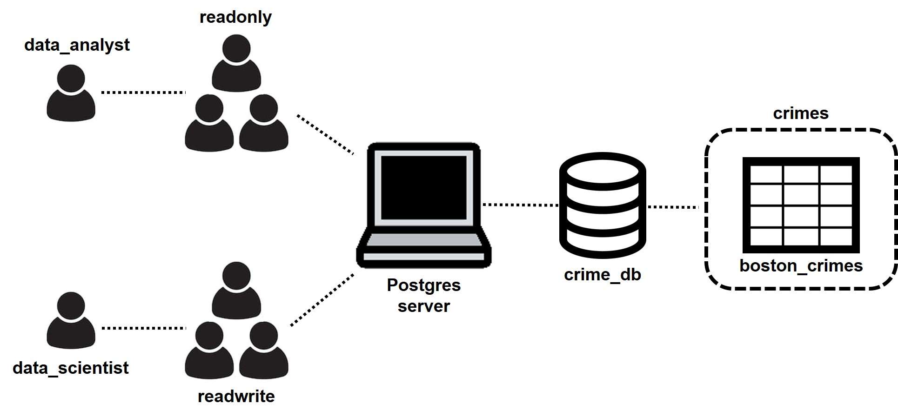

# Building a Database for Crime Reports

In this guided project by Dataquest (Data Engineering track), I built a database using PostgreSQL for storing data related to crimes that occurred in Boston.  Dataquest provided the dataset `boston.csv` for input. My goal in this project is to:

* Create the database `crime_db` with the table `boston_crimes`
* Create the table with the appropriate data types for storing the information from `boston.csv`
* Store the table inside the schema `crimes`
* Create the user groups `readonly` and `readwrite` with appropriate privileges 
* Create the users `data_analyst` and `data_scientist` and assign to `readonly` and `readwrite` groups, respectively
* Verify if the privileges of user groups are set accordingly

To accomplish my goals in this project, I performed the following:

* Created the required database and schema after installing PostgreSQL and `psycopg2` module 
* Explored the column headings and content of `boston.csv` to determine the appropriate data types
* Created the required table using the appropriate data types
* Loaded the data from `boston.csv` into the table
* Created the user group `readonly` which has the following privileges: database connection, schema usage, and data selection from all tables in the schema
* Created the user group `readwrite` which has similar privileges with `readonly` and capable of inserting, deleting, and updating the data in all tables in the schema
* Created the requested users and assigned them to their respective user groups
* Tested the database if correct objects were created and users/groups have the right privileges

At the end of the project, I built my Postgre database for the Boston crime reports as illustrated below. 

For more information, please see the `Project5.ipynb` notebook and the `boston.csv` file above. 
